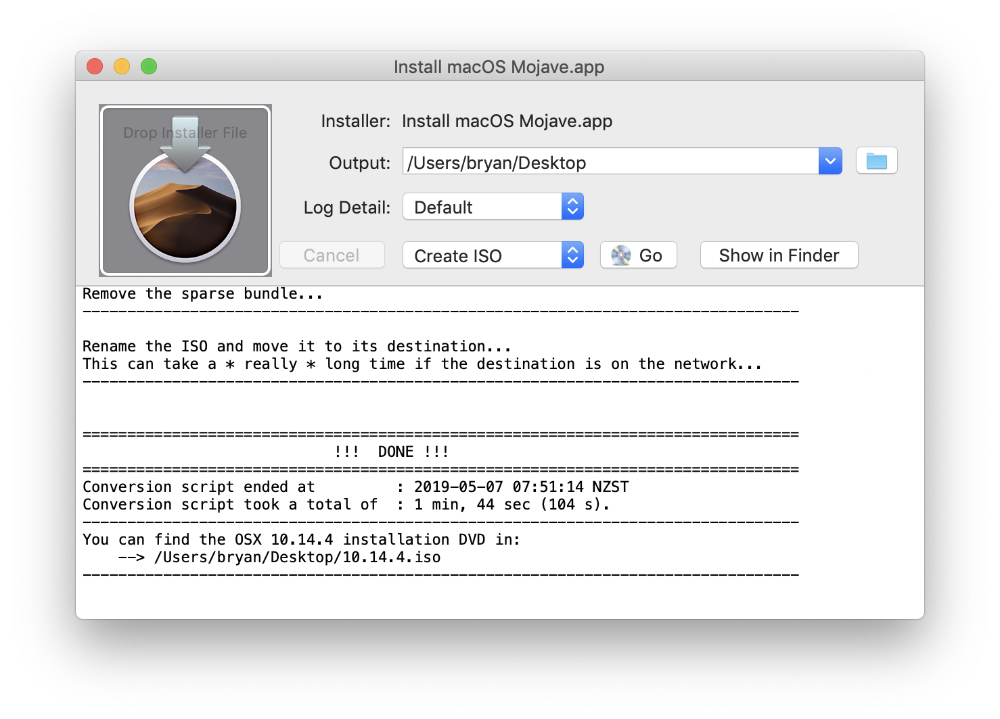

# InstallerApp2ISO

#### Download compiled and notarized application
You can download the most recent compiled release of InstallerApp2ISO from <a href="https://www.whatroute.net/installerapp2iso.html">the WhatRoute web site</a>.

#### Overview
InstallerApp2ISO is a macOS wrapper GUI application designed to create a bootable installer ISO file for macOS by running the bash script InstallerApp2ISO.sh developed by socratis @ VirtualBox forums. 

InstallerApp2ISO can generate bootable ISO installer files for macOS 10.8 and later.

Using its builtin script, apfsvdi.sh, InstallerApp2ISO can also create a <a href="https://www/virtualbox.org/">VirtualBox</a> disk image (VDI) file that is suitable for a VirtualBox installation of macOS 10.14.x (Mojave) or later. This option requires the macOS installer you are using to be for macOS 10.14..x or later.

InstallerApp2ISO is compiled to run on Macintosh computers that run macOS 10.9 (Mavericks) or later.

If you have problems with InstallerApp2ISO then please email bryan@whatroute.net

#### Why do I need this application?
Unfortunately, many users are daunted by the macOS Terminal command line. A GUI gives them more confidence in what they are doing.

#### Why can't I just create a VDI using VirtualBox
VirtualBox can create a VDI file but unfortunately this will not boot macOS 10.14.x

When InstallerApp2ISO creates a VDI file it copies a necessary driver file for booting an APFS formatted partition from the macOS Installer application into the EFI partition on the new drive.

#### Can I run the shell script without this application?
Indeed you can. You can export (**File/Export Script**) the embedded bash scripts, InstallerAppToISO.sh and apfsvdi.sh, to any folder (for which you have access) on your Mac and execute them from the Terminal command line.

### Building InstallerApp2ISO
#### Prerequisites
* Xcode 10.2 or later
* An Apple Developer Code Signing Certificate. This is not essential but does make life easier. The source references my own certificate and you will nedd to replace/remove this to successfully build InstallerApp2ISO.

You can build InstallerApp2ISO with either the Xcode 10.2 IDE or from the command line using the supplied Makefile.

### Running InstallerApp2ISO
Double click InstallerApp2ISO to launch the application.

1. **Click-Drag** an 'Install macOS \<system\>' application (where \<system\> is e.g. Mojave or Sierra) and **Drop** it onto the panel at top left of the window (where it says - 'Drop Installer File'). Alternatively you can use the File/Open menu to select the input installer application.
2. Select the file type that you wish to create then click the *Go* button and wait for the spinning indicator to stop. Progress messages (or heaven forbid, errors!!) will be displayed in the lower panel.
3. On completion of the file creation, you will see a button 'Show in Finder'. If you click this, the folder containing your new file will be opened. By default, this will be your account desktop.
4. You can select a different folder than the default (Desktop) by clicking the folder icon at top right of the window before clicking the *Go* button.

This screenshot shows a successful run of InstallerApp2ISO.

##### Create APFS vdi file from Installer
<video width="640" controls>
	<source src="images/installer2vdi.mp4" type="video/mp4">
</video>

### Advanced Usage
#### Run from the command line
You can use **File/Export Script** to export the embedded shell script engine (InstallerApp2ISO.sh) to another folder on your machine and then run it from the Terminal command line.

List the shell script (in your favourite text editor or using commands such as *cat* or *less* - but take care not to modify it) to view the usage and allowable options.

### Logging
InstallerApp2ISO.sh produces extensive logging of its activities. Using the **Log Detail** button you are able to control the verbosity of this logging. Set the detail you want *before* creating the ISO file.

You can save the output logging to a text file with the menu commands:
 
* Save Log...
* Save Log As...
